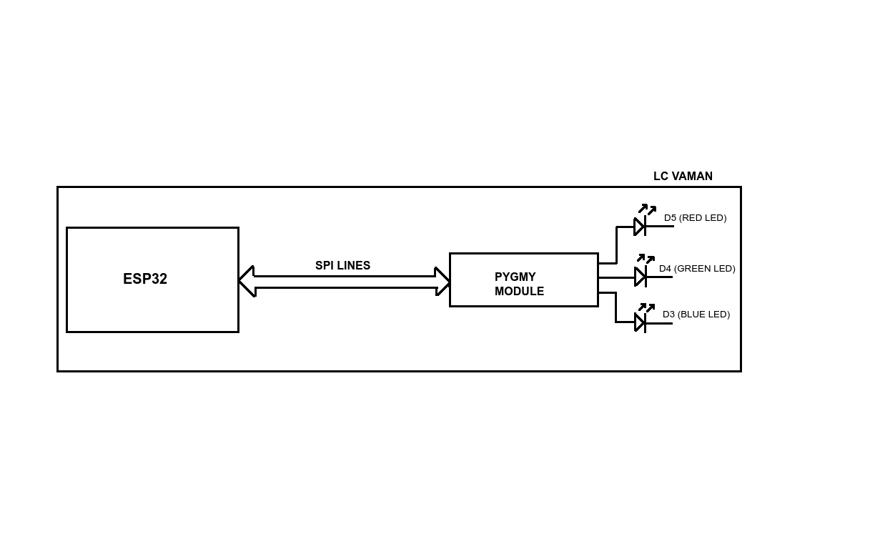

# ESP32 EOS_S3 BREATHE_CTRL

In this project we flash the PWM module for LED breathing effect in the eFPGA of EOS_S3, 
and we control the duration of the breathing effect from the ESP32.

The Pygmy module and the ESP32 on the LC vaman are connected through SPI lines.
(Jumper caps J7, J8, J9 and J10)

<p>
  
</p>

## Theory of operation

- LED brightness can be achieved by rapidly turning on and off the LED; the
longer we leave the LED on, the brighter it will appear. So long as we
"flash" the LED at a high rate, this will be imperceptable to the human
eye. This circuit uses a 256 clock-cycle period in which *a varying fraction*
of that period the LED is on. 

- To create a breathing effect, we slowly modulate the brightness level, first
increasing it until it reaches 100%, then slowly decreasing it.

<pre>
|MIN| | <---------- INHALE ----------> | MAX | <---------- EXHALE ----------> | |MIN|
| <----------------------------------- COUNTER -----------------------------------> |
| <--- 256 ---> || <--- 256 ---> || <--- 256 ---> || <--- 256 ---> || <--- 256 ---> |
| ON |   OFF    ||  ON   |  OFF  ||    ON |OFF    ||  ON   |  OFF  || ON |   OFF    |
|  inhale period, increasing on period    |    exhale period, decreasing on period  |
</pre>

- step-counter -> will be used to mark the start of a step-period (1/60 sec)
at each step mark, the step-period-counter start running and run for 256 clock cycles.
at each step, the duty-cycle will be incremented from zero to 255, rollover to zero 
and upto 255 again.
Each time duty-cycle reaches 256, we toggle between inhale and exhale mode.

- step-counter 
   -> trigger step-period-counter -> duty-counter running
   -> trigger duty-cycle-increment
   -> && duty-cycle reaches max -> toggle inhale mode
    
- at each clk -> check mode, duty-cycle, duty-counter and set the BREATHE_o on or off.
if (inhale), BREATHE_o is ON as long as (duty-counter < duty-cycle (duty-cycle is increasing)
if (exhale), BREATHE_o is ON as long as (duty-counter > duty-cycle (duty-cycle is decreasing)

- next_ctr -> triggers duty cycle change, happens every "period" cycles (24-bits)
at each next_ctr, duty cycle changes by 1, and we need 0 - 0xff - 0 for inhale-exhale
so, duty_cycle sets = 256x2 = 512.

- if period cycles = 0x10000 (0x10000 cycles at each brightness level in inhale+exhale)
then one inhale-exhale = 0x10000 * 512 = 65536 * 512 = 33 554 432 clocks or 0x2000000 clocks.
with 8-bit pwm, 12MHz input clock, 0x10000 cycle period per duty-cycle will give 
an approximately human breathing cycle appearance ~3seconds.


## Controlling using ESP32

To change the breathe duration we write different values in the FPGA peripheral base registers,
Now to do it from ESP32, we first add the component 'ql_spi' in the esp32 project under 'components' 
directory. This component has some library functions which enable us to communicate directly with 
the EOS_S2.

Now to write into the EOS_S3 peripheral registers we use the function:

```
QL_Status QLSPI_Write_S3_Mem (uint32_t addr, uint8_t *data, uint32_t len) 
```

'addr' is the address of the register we wish to write into,
'data' is the value to be written and 'len' is the length of the data to be written. 

The FPGA peripheral registers of EOSS_S3 we wish to write start from 0x40020000 
So for example to write into RED LED register we have the macro value:

```
#define PERIPH_BASE                                             (0x40000000)
#define FPGA_PERIPH_BASE                                        (PERIPH_BASE + 0x00020000)    
#define FPGA_ONION_PERIPH_BASE_ADDR                             FPGA_PERIPH_BASE            //0x40020000

#define FPGA_ONION_BREATHECTRL_MODULE_OFFSET                    0x00003000

#define FPGA_ONION_BREATHECTRL_REG_OFFSET_BREATHE_0_CONFIG      0x0000

#define FPGA_ONION_BREATHECTRL_REG_ADDR_BREATHE_0_CONFIG        (uint32_t*)(FPGA_ONION_PERIPH_BASE_ADDR + \
                                                                FPGA_ONION_BREATHECTRL_MODULE_OFFSET + \
                                                                FPGA_ONION_BREATHECTRL_REG_OFFSET_BREATHE_0_CONFIG)  // (0x40020000+0x00003000+0x00000000 = 0x40023000)
```

The data we write into this register (0x40023000) from the above example, to control the breathing of RED LED, is the
duration of the breathe cycle.

We call the following function continuously to enable the breathing effect: 

```
void breathe_enable(uint8_t pad_num, uint32_t breathe_period_ms)
```

we pass the pad number 'pad_num', pad 18 for LED blue, pad 21 for LED green and pad 22 for LED red.
and the duration of the breathing effect 'breathe_period_ms'

we convert the breathe duration into the clock cycles per step:

```
// clock_cycles/1000msec = clock_rate_hz	
clock_cycles = ((float)clock_rate_hz/1000) * breathe_period_ms; // prevent 32-bit overflow!

// remember that the value passed in here is for the duration of the breathe cycle (inhale+exhale)
// we need to convert this to clock_cycles/step, where total_steps = 2*(1<<PWM_RESOLUTION_BITS)
clock_cycles_per_step = (float)clock_cycles/512;
```
Now we have the values to be passed into the function 'QLSPI_Write_S3_Mem', which is called inside the breathe anable function.

##Building and Flashing

-To build and flash the FPGA binaries place this project into the 'qf_apps' directory of the qorc-sdk.
Run 'source ../../envsetup.sh', then navigate to 'fpga' directory present inside this project and run the command 'make' 
from the command line to build the project. 

Now to flash the binary run the following command :
```
qfprog --port <COM port> --appfpga ./rtl/AL4S3B_FPGA_Top.bin --mode fpga
```

- To flash the ESP32 navigate to esp_fpga_breathectrl directory and run the command
'get_idf' and 'idf.py build' to build the project, and 'idf.py flash -p <COM port>' to flash the binaries into the ESP.


