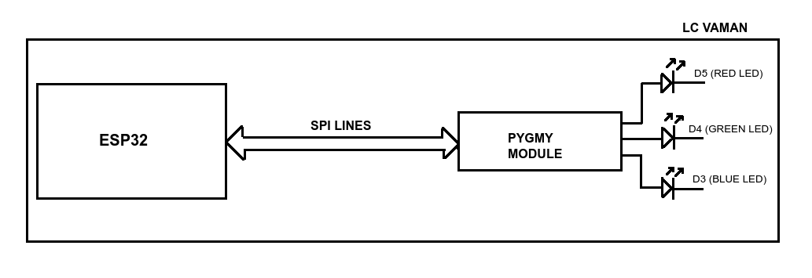

# ESP32 EOS_S3 BREATHE_CTRL

In this project we flash the PWM module for LED breathing effect in the eFPGA of EOS_S3, 
and we control the duration of the breathing effect from the ESP32.

The Pygmy module and the ESP32 on the LC vaman are connected through SPI lines.
(Jumper caps J7, J8, J9 and J10)

  

